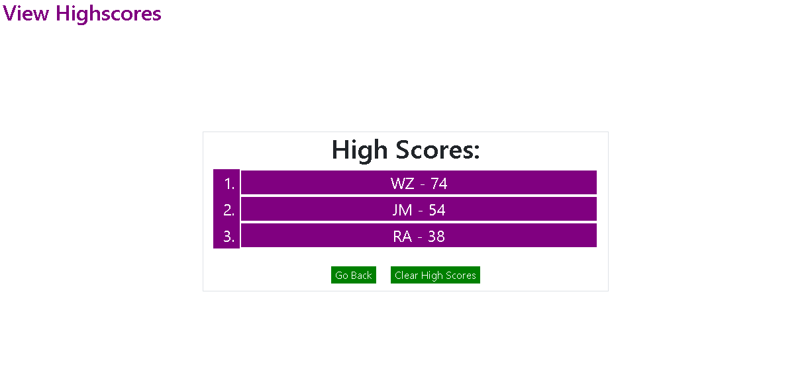

# quiz-game
# Code Quiz
application: https://jmerges.github.io/quiz-game/ 
 
James Merges  
email: jamesmerges1@gmail.com  
github: https://github.com/jmerges  
linkedin: https://www.linkedin.com/in/james-merges-b938401b7/  
 
## Description
This application is a little quiz that tests the user's coding knowledge. It features a timed quiz with several multiple choice questions and a high score page which displays all the high scores stored on the machine.  
 
## Tools Used
HTML, CSS and Bootstrap were used to construct the basic layout of the page, and javascript was used to run the quiz.
 
## Preview
